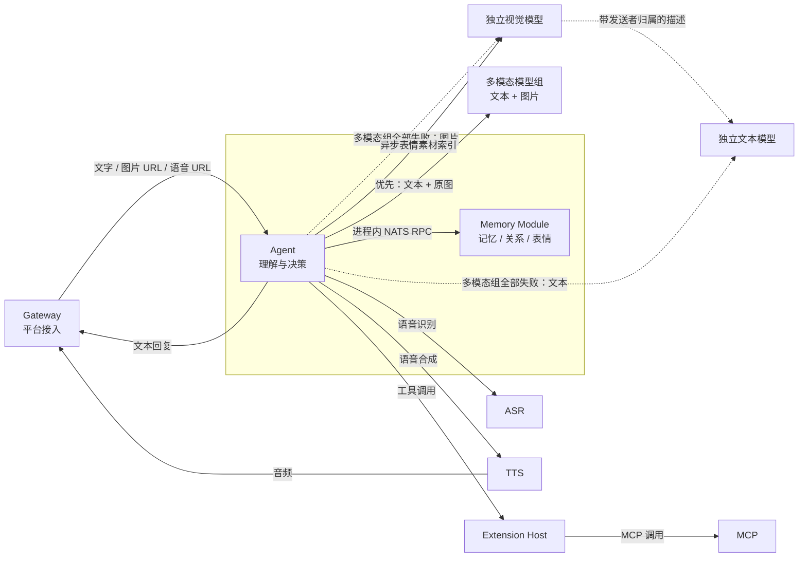

# AI-Love

面向实时直播与社交平台的数字 AI 系统。AI 拥有持续身份、独立记忆、关系、作息、账号和工具能力；承认自己的数字身份，不伪装成人类身体。

## 插件化运行

业务通过统一插件宿主管理，当前包含 17 个内置插件。运行 `python -m plugin_runtime --role <宿主名称>`，登录自建管理页面进入“能力工坊”（`#/plugins`），即可发现、安装、启用、停用、重启或移除本地插件，并预检依赖、查看持久化操作结果。

内核负责生命周期、资源作用域与控制面；业务能力通过声明式清单和能力接口接入。详见 [架构、启动与扩展指南](docs/plugin-runtime.md) 和 [验证记录](docs/plugin-validation.md)。

## 调用关系



Gateway 只处理平台协议、账号路由和消息归一化。它把文字、图片 URL、语音 URL 交给 Agent，不负责图片理解、语音识别或回复决策。

`model_config.multimodal_model_ids` 是第一优先级模型组，按配置顺序尝试；只有整组全部失败，才使用原有 `image` 独立视觉模型生成带发送者归属的图片描述，再交给 `model_config.model_id` 独立文本模型。模型 ID 对应 `ailove.config` 中的 `llm.models` 条目，API Key 实际值由条目的 `api_key_env` 从进程环境读取。未配置多模态模型组时，保持原有分离链路。

## 代码包边界

```text
agent/                      # Agent 运行时与编排入口
├── conversation/          # 对话上下文、Prompt、模型响应与会话状态
├── social/                # 社交消息、群聊、空间评论与表情
├── vision/                # 图片获取、传输封装与表情素材分析
└── speech/                # TTS 接口与 GPT-SoVITS 适配
gptsovits/                  # 语音合成服务及 GPT-SoVITS、MIMO 引擎
gateway/                    # 平台接入、消息归一化、账号路由与 QQ 空间
memory/                     # ai-agent 进程内的记忆、关系、表情与持久化模块
extensions/
├── host/                   # 工具发现、绑定、权限和调用网关
└── mcp/                    # 单一 MCP 进程
    ├── weather/            # 天气工具
    ├── music/              # 音乐控制工具
    └── web_search/         # 网络搜索工具
live/
├── director/               # 直播阵容和发言调度
├── avatar/                 # 形象与舞台事件模块
├── stream/                 # OBS 与推流控制模块
└── edge_service.py         # edge 侧统一进程入口
shared/
├── contracts/              # 跨进程消息契约；rpc/ 保留请求响应命名空间
├── *_settings.py           # 跨运行单元配置模型
├── *_repository.py         # 确实被多个运行单元复用的数据访问
└── nats_bus.py 等          # 共享运行时能力
```

顶层包对应可独立理解或运行的业务单元。规模较小的包直接使用扁平模块；模块较多时按对话、社交、视觉、语音等功能内聚建立子包，不按 controller、service、repository 等技术角色切目录。`shared` 只存放确实被多个运行单元共同使用的契约与实现，不接收单一服务的私有代码。

## 包与微服务

拆包不等于拆微服务。当前部署单元为：

- `gateway`：包含 `gateway` 包。
- `ai-agent`：包含 `agent` 与 `memory` 包；一个进程可热加载多个 Agent Runtime，并承载共享 Memory Module。
- `gptsovits`：包含 `gptsovits` 包，通过 HTTP 和 NATS 提供合成能力；Agent 侧适配位于 `agent.speech.gpt_sovits_provider`。
- `extension-host`：包含 `extensions.host`。
- `mcp`：唯一 MCP 部署，同时加载天气、音乐和网络搜索能力，新增 MCP 能力不新增部署。
- `director`：承载直播阵容和发言调度。
- `live-edge`：合并承载 avatar 与 stream 两个 edge 侧直播模块。

音乐能力目前保持原实现范围：MCP 工具负责接收并记录控制指令，实际播放器适配器仍待接入。

NATS 是运行时事件总线。Kubernetes ConfigMap/Secret 是 `agent.catalog`、`agent.default`、`agent.<ai_id>`、服务配置和全局配置的来源。

## 长期记忆链路

消息处理阶段不调用记忆模型。Agent 在一个真实消息回合结束后只发布 `memory.activity`；同进程的 Memory Module 用 JetStream 持久订阅活动事件，并在 JetStream KV 中保存每个 `ai_id + person_id` 的最新活动水位。

联系人进入静默期后，Memory Module 从 PostgreSQL 的真实 `messages` 调用链读取尚未处理的完整会话片段，一次生成 Episode 摘要和原子记忆。原子记忆先写入 `memory_atoms`，随后按联系人或 AI 自身进入 KV 聚合批次；达到 Episode 数、Atom 数、估算 token 数或最长等待时间任一阈值后，才调用一次合并模型更新 `memory_documents`。

```text
message → memory.activity → quiet episode → memory_atoms
        → pending batch → person/self consolidation → memory_documents
```

同一 owner 的提取与合并通过 KV revision 的 CAS claim 串行化，不同 owner 可以并行。`person` 和 `self` 使用独立阈值，`self` 的更新更保守。对话 Prompt 动态装配固定身份、自我 Markdown、联系人 Markdown、历史 Episode 摘要、近期原文和本轮消息。

## 配置

生产配置由 Kubernetes ConfigMap/Secret 挂载，支持监听更新。配置准备、热更新和迁移步骤见 [Kubernetes 配置指南](docs/kubernetes-config.md)。

```text
agent.catalog             # 声明 active_ai_ids
agent.default             # 配置所有 AI 共用的 Prompt、关系、作息、模型与工具
agent.<ai_id>             # 只配置身份、人格、声音与形象等个性化覆盖
service.<service-name>    # 配置服务与平台 Adapter 参数
director.<session_id>     # 配置直播场次
ailove.config             # 配置全局运行参数与 QQ 白名单
```

新增 AI：发布精简的 `agent.<ai_id>` 个性化覆盖，把 ID 加入 `agent.catalog`，并在账号绑定表中建立显式绑定。运行时会将它与 `agent.default` 递归合并，列表配置由个性化配置整体覆盖；无需复制通用 Prompt、关系策略或记忆实现。

## Agnes 免费对话模型

`ailove.config/llm.models` 已注册 `agnes-3.0-flash` 和 `agnes-2.5-flash`，
使用 `agnes` provider、`https://apihub.agnes-ai.com/v1` 和进程环境变量 `AGNES_API_KEY`。
适配器沿用项目的对话、工具调用和记忆链路，通过工具调用返回结构化结果，仅接受这两个模型名称。
默认对话、群聊判断和记忆使用 `agnes-3.0-flash`，图片理解配置保持原样；本次不增加图片或视频生成功能。

本地 Compose 从 `deploy/.env` 读取密钥并传入 ai-agent；该文件被 Git 和 Docker 构建上下文排除。
直接运行 Python 时需要自行设置进程环境变量（程序不会自动加载 `.env`）；
Kubernetes 使用现有 `ailove-secrets` 的 `envFrom`，需在部署时注入 `AGNES_API_KEY`。
请勿把真实密钥写入普通 ConfigMap 或提交到仓库。

需要切换默认模型时，修改 `agent.default` 中以下配置，并确认各 `agent.<ai_id>` 没有另行指定模型；使用另一免费模型时将两个模型 ID 改为 `agnes-2.5-flash`：

```yaml
model_config:
  model_id: agnes-3.0-flash
  group_repeat_model_id: agnes-3.0-flash
  multimodal_model_ids: []
```

此配置让文本对话、群聊判断和记忆使用 Agnes，图片继续通过原有独立视觉模型生成描述。
清空 `multimodal_model_ids` 是为了避免已有优先模型组继续接管对话。
现有视觉和语音服务的计费不受此新增模型配置影响。

2026-09-26 核对的[官方价格](https://www.agnes-ai.com/zh-Hans/docs/pricing)显示，这两个模型的缓存输入、输入和输出当前均为零价。
免费属于当前优惠，名称白名单不会自动检测后续价格变化，启用或长期使用前应重新核对价格。
接口依据：[2.5 Flash](https://wiki.agnes-ai.com/en/docs/agnes-25-flash)、[3.0 Flash](https://wiki.agnes-ai.com/en/docs/agnes-30-flash)。

## 当前约束

- 先接通现有单 QQ 账号，再接 B站。
- NapCat 登录态必须保留，部署不得重启或重建 NapCat。
- QQ 白名单沿用现有 Kubernetes 配置；私聊 24 小时被动回复，主动联系只在 AI 工作作息内。
- `relationship_policy.group_ceiling_whitelist` 中的群聊可在非工作时间参与回复，仍遵守主动行为开关、冷却及参与判断。
- QQ 空间遍历全部好友，并按该 AI 与每个人的多维关系分别判断点赞和评论。
- 禁止工具删除消息、修改账号资料、读取或导出凭据。

## 本地启动

```bash
docker compose -f deploy/docker-compose.yml up -d
```

生产部署不能通过初始化脚本覆盖服务器现有白名单，也不能重启或重建 NapCat。

技术栈：Python 3.11、PostgreSQL/pgvector、NATS、Kubernetes、Docker Compose、NapCat、OBS、Live2D、GPT-SoVITS。
