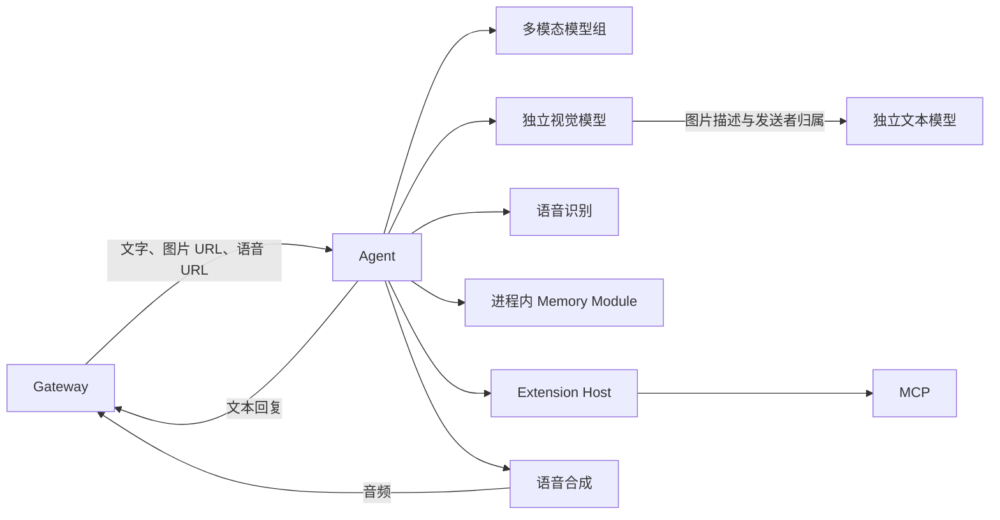

# AI-Love

面向实时直播与社交平台的数字 AI 系统。每个 AI 以数字身份拥有持续人格、独立记忆、人物关系、作息、账号和工具能力。

## 插件能力

统一插件宿主提供本地插件目录、能力依赖、生命周期、资源作用域和持久化操作记录。基础目录包含 17 个内置插件、7 种宿主；2026-09-30 的验收范围包含 structured-output，共 18 个 active 插件。

管理页面“能力工坊”位于 `#/plugins`，提供目录查询、变更预检、安装、启停、重启、移除和操作结果。架构与入口见 [插件运行时](docs/plugin-runtime.md)，验收数据见 [插件验证结果](docs/plugin-validation.md)。

## 运行职责

| 运行单元 | 能力 |
| --- | --- |
| gateway | 平台协议、消息归一化、账号归属、QQ 与 QQ 空间投递 |
| ai-agent | 多人物运行时、理解、决策、回复与进程内 Memory Module |
| gptsovits | HTTP / NATS 语音合成与 GPT-SoVITS、MIMO 引擎 |
| extension-host | 工具发现、可信授权与调用网关 |
| mcp | 单一 MCP 服务中的天气、音乐指令记录、网络搜索和结构化结果工具 |
| director | 直播场次、阵容与发言调度 |
| live-edge | 同进程形象与推流模块 |

音乐能力的交付结果为控制指令接收与记录。Avatar、Stream 的现有交付范围以事件订阅和日志回调为准。



`model_config.multimodal_model_ids` 定义优先模型组及调用顺序。独立视觉和文本模型提供备用路径；空模型组配置对应分离路径。模型 ID 对应 `ailove.config/llm.models`，密钥由 `api_key_env` 指向的进程环境提供。

## 代码结构

```text
agent/
├── conversation/      # 上下文、提示词、模型响应与会话状态
├── social/            # 私聊、群聊、空间评论与表情
├── vision/            # 图片资源、传输与素材分析
└── speech/            # TTS 接口与调用适配
gateway/               # 平台、账号、路由与 QQ 空间
gptsovits/             # 语音服务与引擎
memory/                # 记忆、关系、表情与持久化
extensions/
├── host/              # 工具发现、授权与调用
└── mcp/               # 天气、音乐、搜索与结果工具
live/
├── director/          # 场次与发言调度
├── avatar/            # 形象与舞台事件
├── stream/            # OBS 与推流控制
└── edge_service.py    # 合并运行入口
shared/                # 跨运行单元复用的契约、配置、仓库与基础能力
```

包按业务职责内聚。部署边界以运行单元为准，Memory 位于 ai-agent 进程内；`shared` 的内容具有实际跨运行单元使用者。

## 长期记忆

长期记忆以真实消息、活动水位、静默 Episode、原子记忆和批量文档为依据。JetStream 持久订阅 `memory.activity`，KV 保存 `ai_id + person_id` 的最新活动水位及 CAS claim，PostgreSQL 保存原文、Episode、Atom 和 Markdown 文档。

记忆模型调用以静默窗口及 Episode 数、Atom 数、估算 token 数、最长等待时间阈值为条件。`person` 与 `self` 使用独立阈值，自我记忆采用更保守的更新标准。同一 owner 具有串行写入权，各 owner 可并行。

对话上下文包含固定身份、自我 Markdown、联系人 Markdown、Episode 摘要、近期原文与本轮消息。正式人物配置决定核心身份，来源 ID 与受众授权决定事实归属和披露范围。

## 配置结果

生产配置来自 Kubernetes ConfigMap/Secret 挂载卷，具备热更新能力。资源及字段见 [Kubernetes 配置](docs/kubernetes-config.md)。

| 配置标识 | 内容 |
| --- | --- |
| agent.catalog | active_ai_ids |
| agent.default | 共享 Prompt、关系、作息、模型与工具 |
| agent.\<ai_id\> | 身份、人格、声音与形象等个性化覆盖 |
| service.\<service-name\> | 服务与平台 Adapter 参数 |
| director.\<session_id\> | 直播场次 |
| ailove.config | 全局参数与 QQ 白名单 |

人物运行结果由个性化覆盖、共享默认配置、目录成员资格和数据库账号绑定共同确定。对象递归合并，列表由个性化配置整体覆盖。

## Agnes 对话模型

模型目录包含 `agnes-3.0-flash` 和 `agnes-2.5-flash`，provider 为 `agnes`，地址为 `https://apihub.agnes-ai.com/v1`，密钥环境变量为 `AGNES_API_KEY`。对话、群聊判断和记忆的默认模型为 `agnes-3.0-flash`，图片由独立视觉模型提供描述。

```yaml
model_config:
  model_id: agnes-3.0-flash
  group_repeat_model_id: agnes-3.0-flash
  multimodal_model_ids: []
```

本地 Compose 的密钥来源为私有 `deploy/.env`；Python 直接运行的密钥来源为进程环境；Kubernetes 的密钥来源为 `ailove-secrets`。真实凭据保存在私有部署资料及 Secret 中，仓库和构建上下文使用公开模板。

2026-09-26 的[官方价格](https://www.agnes-ai.com/zh-Hans/docs/pricing)记录显示，两模型的缓存输入、输入和输出均为零价。长期费用依据使用时的官方价格。接口资料：[2.5 Flash](https://wiki.agnes-ai.com/en/docs/agnes-25-flash)、[3.0 Flash](https://wiki.agnes-ai.com/en/docs/agnes-30-flash)。视觉及语音费用按各自服务计价。

## 产品规则

- 平台优先级为现有单 QQ 账号、B 站。
- 部署结果保留 NapCat 容器、登录态、既有白名单和业务数据。
- 有效私聊全天回应；主动联系适用于人物工作时段及联系额度。
- `relationship_policy.group_ceiling_whitelist` 中的群聊具有全天参与资格，实际参与遵循行为开关、冷却和场景判断。
- QQ 空间互动以该 AI 与每个人的多维关系为依据。
- 工具允许范围为已授权的业务查询与动作；消息、账号资料和凭据由各自管理边界保护。

## 本地运行入口

```bash
docker compose -f deploy/docker-compose.yml up -d
```

技术栈：Python 3.11、PostgreSQL/pgvector、NATS、Kubernetes、Docker Compose、NapCat、OBS、Live2D、GPT-SoVITS。
