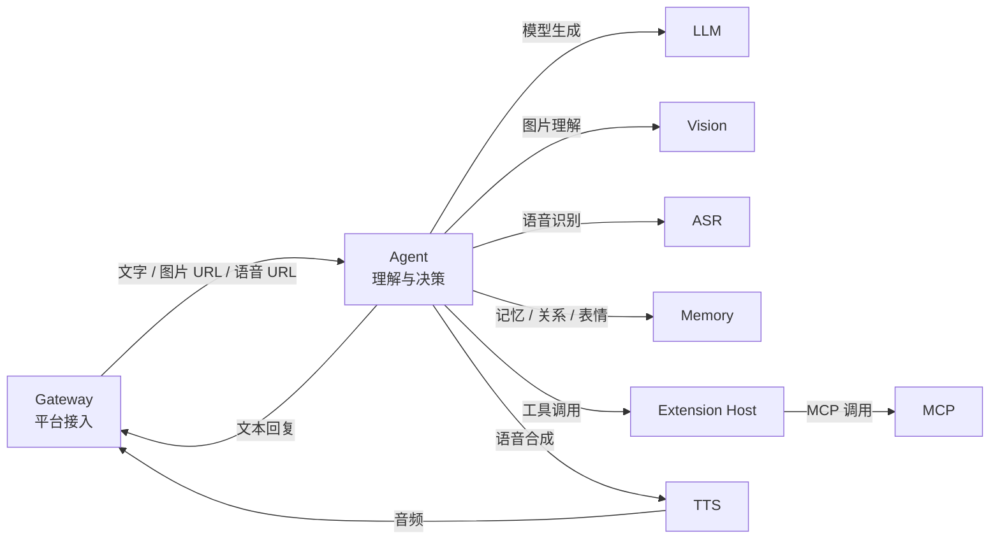

# AI-Love

面向实时直播与社交平台的数字 AI 系统。AI 拥有持续身份、独立记忆、关系、作息、账号和工具能力；承认自己的数字身份，不伪装成人类身体。

## 调用关系



Gateway 只处理平台协议、账号路由和消息归一化。它把文字、图片 URL、语音 URL 交给 Agent，不负责图片理解、语音识别或回复决策。

## 代码包边界

```text
ai/                         # 底层 AI 调用能力，与 Agent 业务无关
├── llm/                    # 文本生成与模型路由
│   └── providers/          # Anthropic Gateway、DeepSeek、Ollama
├── vision/                 # 图片理解
│   └── providers/
├── asr/                    # 语音识别接口与 Provider 注册
│   └── providers/
└── tts/                    # 语音合成接口、Provider 与服务入口
    └── providers/

agent/                      # 理解、决策和对话编排
├── application/            # 社交、直播、主动聊天、记忆压缩用例
├── context/                # 会话窗口、检索、发言状态、消息理解
├── generation/             # Prompt、Agent Loop、模型响应解析
├── clients/                # Memory、TTS、表情库、Extension Host 客户端
└── persona/                # Agent 身份与人格模型

gateway/                    # QQ、微信、B站、QQ 空间接入与账号路由
memory/                     # 记忆、关系、表情业务及持久化
extensions/
├── host/                   # 工具发现、绑定、权限和调用网关
└── mcp/                    # 单一 MCP 进程
    ├── weather/            # 天气工具
    └── music/              # 音乐控制工具
live/
├── director/               # 直播阵容和发言调度
├── avatar/                 # 形象与舞台事件输出
└── stream/                 # OBS 与推流控制
shared/
├── contracts/              # 跨进程消息和领域契约
└── infrastructure/         # NATS、Nacos、数据库与服务生命周期
```

四类 AI 能力统一采用 `provider.py`、`registry.py`、`factory.py`、`providers/` 命名。`shared` 只存放确实被多个进程共同使用的契约和基础设施，不存放 Vision 或 Agent 私有响应模型。

## 包与微服务

拆包不等于拆微服务。当前部署单元为：

- `gateway`：包含 `gateway` 包。
- `ai-agent`：包含 `agent`、`ai.llm`、`ai.vision`、`ai.asr`；一个进程可热加载多个 Agent Runtime。
- `tts`：包含 `ai.tts`，通过 NATS 向 Agent 提供合成能力。
- `memory`：包含 `memory` 的 controller、service、repository 等多个内部包。
- `extension-host`：包含 `extensions.host`。
- `mcp`：唯一 MCP 部署，同时加载 `extensions.mcp.weather` 和 `extensions.mcp.music`，新增 MCP 能力不新增部署。
- `director`、`avatar`、`stream`：分别承载 `live` 下的三个直播能力包。

音乐能力目前保持原实现范围：MCP 工具负责接收并记录控制指令，实际播放器适配器仍待接入。

NATS 是运行时事件总线。Nacos 是 `agent.catalog`、`agent.<ai_id>`、服务配置和全局配置的来源。

## 配置

```text
agent.catalog             # 声明 active_ai_ids
agent.<ai_id>             # 配置身份、人格、Prompt、关系、作息、模型与工具
service.<service-name>    # 配置服务与平台 Adapter 参数
director.<session_id>     # 配置直播场次
ailove.config             # 配置全局运行参数与 QQ 白名单
```

新增 AI：发布新的 `agent.<ai_id>`，把 ID 加入 `agent.catalog`，并在账号绑定表中建立显式绑定。无需新增容器或复制记忆实现。

## 当前约束

- 先接通现有单 QQ 账号，再接 B站。
- NapCat 登录态必须保留，部署不得重启或重建 NapCat。
- QQ 白名单沿用现有 Nacos 配置；私聊 24 小时被动回复，主动联系只在 AI 工作作息内。
- QQ 空间遍历全部好友，并按该 AI 与每个人的多维关系分别判断点赞和评论。
- 禁止工具删除消息、修改账号资料、读取或导出凭据。

## 本地启动

```bash
docker compose -f deploy/docker-compose.yml up -d
```

生产部署不能通过初始化脚本覆盖服务器现有白名单，也不能重启或重建 NapCat。

技术栈：Python 3.11、PostgreSQL/pgvector、NATS、Nacos、Docker Compose、NapCat、OBS、Live2D、GPT-SoVITS。
