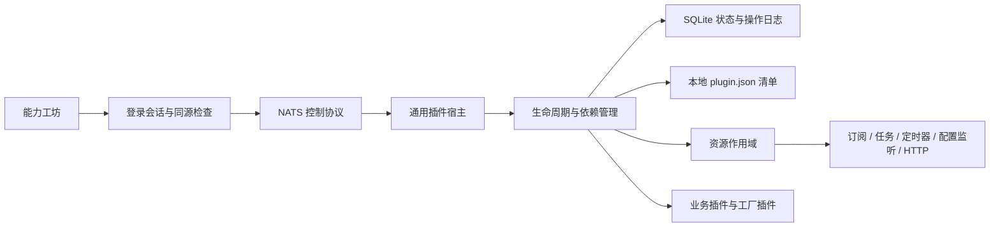

# AI-Love 插件运行时

业务能力通过本地清单注册，由统一宿主管理生命周期；管理页面位于 `#/plugins`（能力工坊）。当前共有 17 个内置插件、7 种宿主。原有领域代码通过适配器接入，模型、渠道、语音实现通过工厂注册表注入。

## 架构与边界



- **小内核**：`plugin_runtime` 只承担发现、契约、能力解析、生命周期和控制面。没有业务包的静态导入；空目录启动无需导入业务实现。
- **依赖倒置**：插件只通过 `context.require()` 取得声明的能力，通过 `context.provide()` 导出能力；同一宿主中每个依赖必须有唯一已安装提供者。
- **适配器**：`plugins/components.py` 复用已有服务；总线、调度器、配置监听和 HTTP 入口统一纳入资源作用域。
- **工厂与策略**：模型、渠道和语音实现由清单配置与 Python entry points 提供；新增实现无需增加内核分支。
- **控制面独立**：业务初始化失败仍可查看日志、停用、重试；管理入口和基础设施属于宿主，不作为可自我卸载的业务插件。

## 内置目录

| 宿主 | 插件 ID | 负责内容 |
| --- | --- | --- |
| ai-agent | agent.environment | Redis、数据库和人物资源 |
| ai-agent | models | 模型策略和创建工厂 |
| ai-agent | memory | 记忆、关系、表情等现有 Memory Module |
| ai-agent | speech.clients | 语音调用适配器工厂 |
| ai-agent | agent | 对话、私聊、群聊、主动联系与人物运行时 |
| gateway | channels | 平台渠道工厂 |
| gateway | gateway | 平台连接、消息归一化与投递 |
| gptsovits | speech.engines | 语音合成引擎工厂 |
| gptsovits | speech.server | HTTP / NATS 语音服务 |
| extension-host | tools | 工具发现、授权与调用网关 |
| mcp | mcp.server | MCP HTTP 服务 |
| mcp | music | 音乐指令工具，沿用现有记录指令实现 |
| mcp | weather | 天气工具 |
| mcp | web-search | 搜索工具 |
| director | director | 直播导演与调度 |
| live-edge | avatar | 形象指令 |
| live-edge | stream | 推流控制 |

模型供应商、具体渠道等目前在相应工厂插件内注册，并非每个实现都具有独立生命周期。`specs/002-plugin-architecture` 中的早期拆包草案不等于本次已全部完成；本实现的交付范围以此目录和验证报告为准。

## 启动与管理

在项目根目录中使用项目现有 Python 依赖环境：

```powershell
$env:AILOVE_BUS_URL = 'nats://127.0.0.1:4222'
$env:AILOVE_PLUGIN_STATE_DIR = 'data/plugins'
python -m plugin_runtime --role live-edge
```

其他角色分别为 `gateway`、`ai-agent`、`gptsovits`、`extension-host`、`mcp`、`director`。每个角色独立进程。同一 NATS 环境中每种角色只运行一个宿主。业务使用现有 Nacos、数据库、Redis 和密钥环境配置；基础设施未就绪时可在管理页看到启动失败。

运行现有管理后端与前端，确保后端的 `AILOVE_BUS_URL` / `AILOVE_BUS_TOKEN` 与宿主一致。登录后进入“能力工坊”：

1. 搜索或按宿主筛选，查看真实状态、能力依赖、在途回调和最近操作。
2. 点击安装、启用、停用、重新启动或移除，先查看变更预检。
3. 停用被其他插件依赖的能力时，必须勾选一并停用依赖插件；预检给出实际顺序和范围。
4. 提交后等待状态更新；请求超时可使用原操作 ID 重试，重复请求不会重复执行。

首次启动时，内置清单的 `enabled` 提供初始状态；之后以持久化状态为准。运行中刷新发现的新插件保持“未安装”，需要手动安装再启用。刷新不会自动执行新增代码。

`install` 是登记本地已交付插件；`remove` 停止实例并移除安装状态，保留交付文件、操作历史和业务数据。管理页面不执行网络下载、pip 安装或文件上传。

Dockerfile 已使用统一插件入口。Compose 和 Kubernetes 清单已补上状态卷与控制连接；这些文件是本地变更，需按现有部署流程交付。**不要并行运行旧入口与新宿主**，否则会重复消费业务消息。旧 Python 入口保留用于既有调用方，但不提供插件管理控制面。

## 生命周期与失败语义

启用按依赖拓扑执行 `initialize → start`，全部声明能力导出后才标记 active。停用按反向依赖执行：

1. 撤销能力导出，封锁新回调并停止新消息入口。
2. 等待已进入的 HTTP / 总线 / 定时回调和已有业务工作排空。
3. 执行 `stop → dispose`，取消托管任务并反向释放资源。

初始化/启动、停止、销毁分别有 30 秒预算，排空有 60 秒预算。超时或释放失败会保留实例所有权，标记 failed；管理员可重试停用再启用。不会将尚未清理的实例伪装成已卸载。

同一宿主串行执行变更；SQLite WAL 保存期望状态、修订号与幂等操作记录。重启恢复期望状态，中断操作标记 interrupted。批量级联失败可能已经完成部分插件的启停，不提供业务事务回滚，应查看每项实际状态后处理。

MCP 工具变化通过真实工具列表传播到工具网关，智能体在下一轮对话刷新工具图；已开始的一轮继续使用它捕获的工具图。已被撤销的远程工具调用仍可能失败，由现有工具错误处理接管。MCP 服务离线时撤销远程工具，保留普通对话与本地工具。

## 接入自己的插件

示例代码：`examples/plugin_echo.py`；清单：`examples/plugin-catalog/echo/plugin.json`。

```powershell
$env:AILOVE_PLUGIN_PATH = (Resolve-Path 'examples/plugin-catalog').Path
python -m plugin_runtime --role live-edge
```

在同一已配置目录下增加 `任意目录/plugin.json` 后，点击“刷新目录”即可发现。`--catalog` 可重复指定，显式使用时替代内置目录；`AILOVE_PLUGIN_PATH` 追加搜索目录（Windows 用分号，Linux 用冒号）。`entrypoint` 对应的 Python 模块必须已交付到宿主可导入路径。

```python
from plugin_runtime import Plugin
from plugin_runtime.adapters import ScopedBus

class EchoPlugin(Plugin):
    async def start(self):
        bus = ScopedBus(self.context.ports['bus'], self.context.resources)
        await bus.reply('example.echo', self.echo)
        self.context.provide('example.echo', self)

    async def echo(self, payload):
        return payload
```

使用 `resources.spawn()` 创建托管任务；`resources.defer()` 登记最终清理；`resources.on_quiesce()` 停止新工作；异步外部回调通过 `resources.guard()` 包装。资源清理需要允许部分初始化和重复尝试。不要直接创建脱离作用域的订阅、后台任务或全局缓存。

## 当前限制

- 插件为受信任的进程内 Python 代码。作用域管理生命周期，不是权限沙箱；不接受不可信代码上传。NATS 控制 subject 应沿用现有受控网络与访问凭据。
- 支持运行中发现新增模块、安装、启停、移除与重新创建实例。Python 已导入模块的代码替换需要重启宿主；没有承诺 importlib.reload、无损代码升级或逐供应商热替换。
- 能力依赖图在单宿主内解析；跨宿主仍通过现有 NATS / HTTP 协议调用，不做分布式启停事务。
- 文件锁防止共用同一状态目录的本地重复进程；不充当跨机器分布式主节点选举。状态目录必须持久化。
- 业务插件保留原有业务数据，不保证取消所有已发出的外部请求，也不会在未知投递结果时重新发送消息。

验证范围见 [验证记录](plugin-validation.md)。
