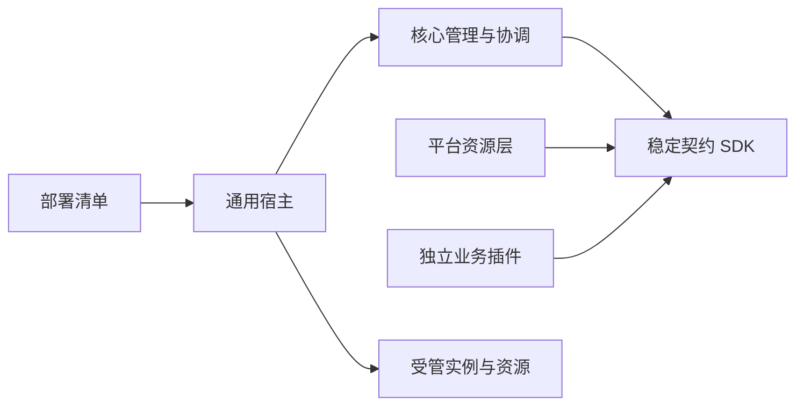

# AI-Love 独立插件目标架构

**设计日期**：2026-09-15。本文定义目标边界，实际交付见 [插件运行时](../../docs/plugin-runtime.md)。

## 核心、契约与实现



| 边界 | 拥有的结果 |
| --- | --- |
| contracts | 元数据、生命周期、能力 DTO、错误、scope 和事件语义 |
| core | 生命周期、能力绑定、操作记录、身份、受众、顺序及动作授权 |
| 平台资源层 | 配置、NATS、PostgreSQL、Redis、时钟、调度与遥测端口 |
| 业务插件 | 平台、生成、模型、语音、视觉、记忆、关系、工具与直播能力 |
| 发布配置 | 批准产物、摘要、启用范围、绑定和权限 |

核心依赖集合为当前公开契约；插件之间通过授权能力连接。每个可变实现独立发布，核心和其他产物保持固定。具体实例由经过核验的清单和工厂确定。

## 清单与接口

目标清单示例：

```json
{
  "id": "ailove.channel.qq",
  "entrypoint": "ailove_plugin_qq:create_plugin",
  "provides": [{"capability": "channel"}],
  "requires": [{"capability": "identity.lookup", "optional": false}],
  "instance_scope": "account",
  "config_schema": "schemas/config.json",
  "state": {"namespace": "ailove.channel.qq", "transfer": "channel-state"},
  "isolation": "worker",
  "upgrade_mode": "drain-and-replace",
  "permissions_requested": ["channel.receive", "channel.send", "identity.lookup"],
  "limits": {"max_inflight": 20, "queue_capacity": 200},
  "ui": [{"kind": "status", "capability": "channel"}]
}
```

发现结果来自 JSON 与元数据，装载资格包含摘要、来源、依赖和授权。id 表示实现，instance_id 表示实例，ai_id 表示人物。显式绑定或唯一候选确定提供者，策略集合采用明确顺序。

Plugin 的 init/start/stop/dispose 返回各自状态 DTO；Loader 的 load/unload 返回执行句柄和回收报告。PluginContext 包含只读配置、可信 scope、能力租约及受限资源端口。InvocationContext 包含事件、人物、账号、会话、受众、deadline、代次和幂等键。

业务边界采用可序列化值对象，SDK 与 ORM 对象保留于各自实现包。完整方法及字段见 [能力契约](contracts/capabilities.md) 和 [生命周期契约](contracts/lifecycle.md)。

## 生命周期与资源结果

每个实例拥有 HTTP、文件、任务、作业、订阅、RPC responder、代理及 UI 贡献。共享资源以借用句柄提供，最终释放权归宿主。

| 结果 | 完成条件 |
| --- | --- |
| 候选就绪 | 配置、能力、健康及资源报告有效 |
| 活动实例 | 持久绑定与代次已提交，业务闸门开放 |
| 停用完成 | 新入口闭合，在途及后台工作有明确终态 |
| 释放完成 | 实例资源账本回到基线 |
| 逻辑卸载 | 管理引用及执行资格已回收 |
| 物理卸载 | worker 进程树已结束 |
| 恢复完成 | 当前代次、状态所有权和动作凭证一致 |

控制阶段预算为 30 秒，排空预算为 60 秒。消费者的运行资格要求提供者能力就绪，提供者资源释放资格要求消费者资源闭合。管理 operation_id、请求摘要与 expected_revision 确定唯一持久结果。

替换成功依据候选核验、旧写入者静止、状态确认以及活动绑定原子提交。已接收请求保留自身快照，新请求采用当前代次。写入边界验证 owner、代次及幂等键，unknown 动作归独立核实状态。

## 配置、权限与数据

配置按插件及实例隔离，覆盖顺序为默认、服务、AI/账号；对象递归、数组整体、标量替换，字段集合采用显式移除语义。有效更新对应完整快照与修订，凭据归受限连接资源。

授权集合为宿主、操作者、插件申请、实例范围和当前调用范围的交集。业务工具动作属于显式允许集合，消息删除、账号资料维护与凭据管理归人工管理权限。副作用边界采用当前授权，可信身份来自入口与账号绑定。

平台持久层拥有身份、账号、会话和发送账本。Memory 数据包括 PostgreSQL 文档、Atom、Episode 及 JetStream KV/consumer 水位，交接资料具有共同静止点和来源核验。私聊账本保留首次归属、固定 run_id、摘要、claim_version 和 unknown。

插件卸载保留用户状态、素材、迁移历史和恢复材料。恢复方案明确代码结果与数据结果，既有 Alembic 历史具有稳定归属。

## 执行模式

| 模式 | 适用范围 | 生效与回收结果 |
| --- | --- | --- |
| trusted-inprocess | 已审核 Memory 与轻量策略 | 可撤销能力与资源释放，代码替换采用声明的宿主重启 |
| worker | 供应商 SDK、渠道与工具 | 独立解释器和依赖，进程树回收 |
| restricted-worker | 具有强隔离要求的代码 | 最小系统身份、受限网络/卷及资源配额 |

执行资格对应实际具备的信任和隔离条件。Memory 保持 ai-agent 同进程，独立交付范围与维护窗口各有明确语义。

## 独立产物与界面

目标目录包含 packages/contracts、packages/core、packages/platform-runtime、hosts/runtime、plugins/<slug>、deployment/manifests 和本地验收环境。31 包明细见 [plan.md](plan.md)。

每个插件包含 pyproject.toml、plugin.json、独立锁、唯一顶层包、schema、tests 和状态说明。正式产物测试在仓库外目录使用安装包来源。通用 UI 渲染 status/form/table/document，当前贡献由目录及授权查询提供。

## 能力与验收结果

既有 QQ、私聊、引用、记忆、模型、语音、工具及直播能力保持自身语义。迁移切换以人物、账号、能力为范围，唯一活动路径拥有外部动作资格，临时包装器具有退出标准。

最小结果为一个实际插件的完整六种变更证据；整体结果为 31 个正式插件的独立产物、状态、权限、资源和入口证据。2 AI、20 会话、10 事件/秒、15 分钟的负载及 5 分钟恢复指标采用目标验收值。逐项标准见 [acceptance.md](acceptance.md)。
